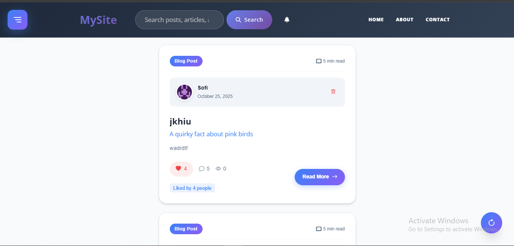
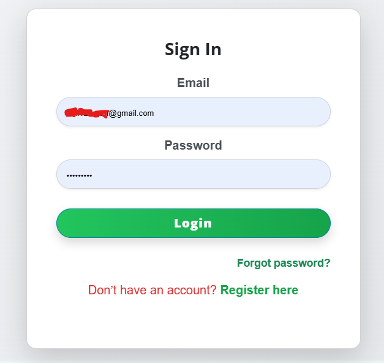
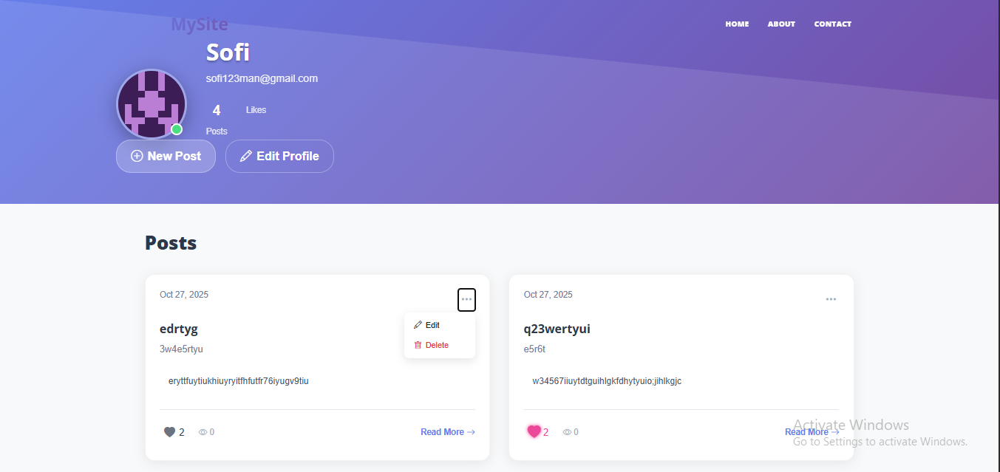
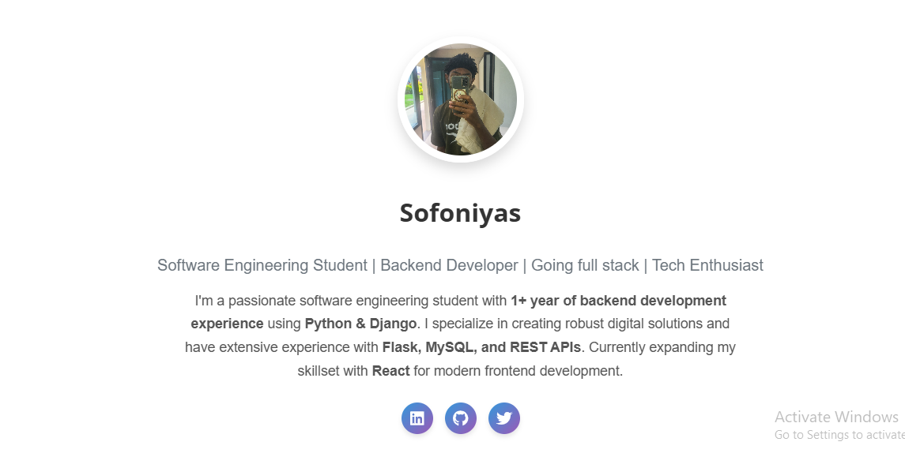
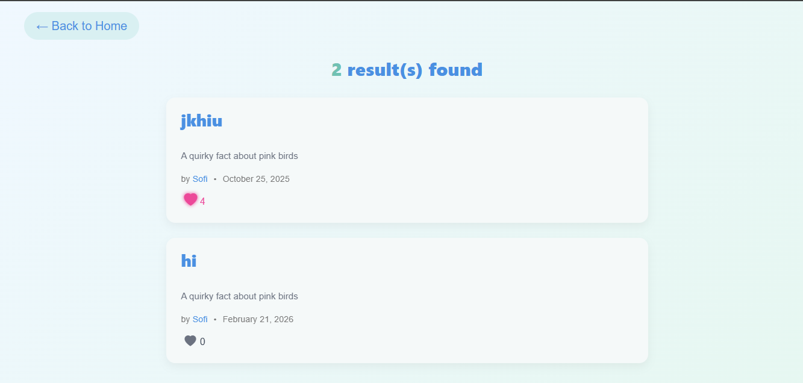
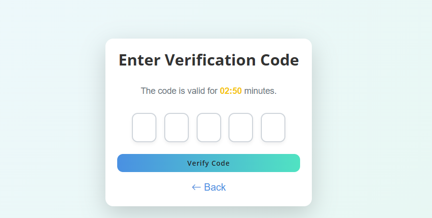

# 📸 Flask Social Platform - Screenshots Gallery

Visual walkthrough of the Flask Social Platform features and user interface.

---

## 🏠 Home Page

*Dynamic feed with blog posts, infinite scroll, and randomized content display*

---

## 🔐 Login Page

*Secure user authentication with email and password*

---

## 👤 User Profile

*Personalized user profiles with Gravatar integration*

---

## 📝 My Posts

*User's personal blog posts management dashboard*

---

## 🔔 Notifications

*Real-time in-app notifications for likes, comments, and interactions*

---

## 🔍 Search Results

*Search functionality to find posts by title or author*

---

## 🛡 Admin Dashboard

*Powerful admin panel for user management and content moderation*

---

## 🔑 Password Reset

*Email-based password recovery with verification code*

---

## ✨ Features Showcased

- **Responsive Design**: Bootstrap 5 UI framework
- **Rich Text Editing**: CKEditor integration for blog posts
- **Social Interactions**: Comments, likes, and notifications
- **Role-Based Access**: User, Admin, and Super Admin roles
- **Security**: Password hashing, CSRF protection, session management
- **Email Integration**: SMTP notifications for account activities

---

[← Back to Main README](../README.md)
